# Advance Taxi Pipeline

## Description
This repository is an advanced version of taxi-pipeline repository for processing taxi trip data from two sources with each using different approach:
1. Batch Pipeline: Process taxi trip data from taxi-pipeline repository using Python scripts to extract and unify both from CSV and JSON files, and upload the files to *Google Cloud Storage (GCS)* then load them into *BigQuery*. Apache Airflow is used to orchestrates and automates these steps.
2. Streaming Pipeline: Simulates real-time taxi data generated using a Python script to act as a dummy data, which then use a Python that acts as a Publisher which sends messages to *Google Pub/Sub* and *Google Dataflow* to process and loads the data into *BigQuery*.

The entire solution is containerized using Docker, ensuring a portable setup.

## Objective
- Combine batch an real-time data processing into a single scalable pipeline
- Utilize Google Cloud services: BigQuery, GCS, Pub/Sub, Dataflow
- Automate batch ingestion and transformation using Apache Airflow
- Portable deployment with Docker containerization

## Folder Structure
### Graph TD

```mermaid
graph TD
    Root --> dags
    Root --> data
    Root --> dbt_modeling
    Root --> scripts
    Root --> keys
    Root --> .env
    Root --> docker-compose.yaml
    Root --> Dockerfile
    Root --> README.md
    dags --> dag_taxi_data_extractor.py
    dags --> dag_taxi_data_loader.py
    dags --> dag_dbt-stg_taxi_batch.py
    dags --> dag_dbt-stg_taxi_stream.py
    dags --> dag_dbt-stg_taxi_stream-full_refresh.py
    dags --> dag_dbt-stg_taxi_payment_type.py
    dags --> dag_dbt-stg_taxi_zone.py
    dags --> dag_dbt-dim_taxi_unified.py
    dags --> dag_dbt-rep_taxi.py
    data --> csv
    csv --> ....csv
    data --> json
    json --> ....json
    data --> ....csv
    dbt_modeling --> models
    models --> stg
    stg --> sources.yaml
    stg --> stg_taxi_batch.sql
    stg --> stg_taxi_stream.sql
    stg --> stg_taxi_payment_type.sql
    stg --> stg_taxo_zone
    models --> mart
    mart --> dim_taxi_unified.sql
    models --> rep
    rep --> rep_taxi.sql
    scripts --> taxi_data_extractor.py
    scripts --> taxi_data_loader.py
    scripts --> taxi_data_stream.py
    scripts --> dataflow_pipeline.py
```

### Tree
```
root
├── dags/
│ ├── dag_taxi_data_extractor.py
│ ├── dag_taxi_data_loader.py
│ ├── dag_dbt-stg_taxi_batch.py
│ ├── dag_dbt-stg_taxi_stream.py
│ ├── dag_dbt-stg_taxi_stream-full_refresh.py
│ ├── dag_dbt-stg_taxi_payment_type.py
│ ├── dag_dbt-stg_taxi_zone.py
│ ├── dag_dbt-dim_taxi_unified.py
│ └── dag_dbt-rep_taxi.py
├── data/
│ ├── csv/
│ │ └── ...csv files
│ ├── json/
│ │ └── ...json files
│ └── ...additional csv files
├── dbt_modeling/
│ └── models/
│  ├── stg/
│  │ ├── sources.yaml
│  │ ├── stg_taxi_batch.sql
│  │ ├── stg_taxi_stream.sql
│  │ ├── stg_taxi_payment_type.sql
│  │ └── stg_taxi_zone
│  ├── mart/
│  │ └── dim_taxi_unified.sql
│  └── rep/
│    └── rep_taxi.sql
├── scripts/
│ ├── taxi_data_extractor.py
│ ├── taxi_data_loader.py
│ ├── taxi_data_stream.py
│ └── dataflow_pipeline.py
├── keys
├── .env
├── docker-compose.yaml
├── Dockerfile
└── README.md
```

## How to Execute the setup Docker
1. Run `docker-compose build` to build the necessary components and dependencies
2. Run `docker-compose up` to turn on all of the services
3. Run `docker-compose ps -a` to check the status of each of the service
4. Once the airflow-webservice is up, go to http://localhost:8080/ to open Apache Airflow
5. Make sure to put the service account key in the `/keys` folder

## How to Execute the Batch Pipeline
1. Execute `dag_taxi_data_extractor` in Airflow to extract all of the taxi data and upload them to GCS: gs://jdeol003-bucket/capstone3_hafizh
2. Execute `dag_taxi_data_loader` in Airflow to load all of the taxi data in GCS and load them to BigQuery: `purwadika.jcdeol3_capstone3_hafizh`

## How to Execute the Stream Pipeline
1. Run `docker-compose exec airflow-webserver python /opt/airflow/scripts/taxi_data_stream.py` to generate dummy taxi data and publish them Pub/Sub with topic: capstone3_hafizh_taxi
2. Run `docker-compose exec airflow-webserver python /opt/airflow/scripts/dataflow_pipeline.py` to create a subscription and load them using Dataflow to BigQuery: `purwadika.jcdeol3_capstone3_hafizh`

## How to Execute the Transformation using dbt
1. Execute `dag_dbt-stg_taxi_batch` in Airflow to create a staging table containing batch data
2. Execute `dag_dbt-stg_taxi_stream` in Airflow to create a staging table containing stream data. Since the stream table materialization type is incremental, the regular dag will only process latest data. In case full-refresh is needed, execute `dag_dbt-stg_taxi_stream-full_refresh`
3. Execute `dag_dbt-stg_taxi_payment_type` in Airflow to create a staging table containing taxi payment type data
4. Execute `dag_dbt-stg_taxi_zone` in Airflow to create a staging table containing taxi zone
1. Execute `dag_dbt-dim_taxi_unified` in Airflow to create a dimension table containing the combination of batch and stream data
1. Execute `dag_dbt-rep_taxi` in Airflow to create a report table containing enriched and transformed data

