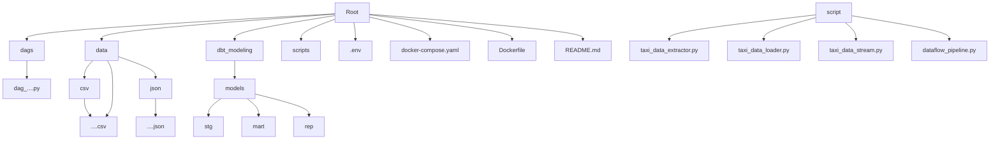

# Advance Taxi Pipeline

## Description
This repository is an advanced version of taxi-pipeline repository for processing taxi trip data from two sources with each using different approach:
1. Batch Pipeline: Process taxi trip data from taxi-pipeline repository using Python scripts to extract and unify both from CSV and JSON files, and upload the files to *Google Cloud Storage (GCS)* then load them into *BigQuery*. Apache Airflow is used to orchestrates and automates these steps.
2. Streaming Pipeline: Simulates real-time taxi data generated using a Python script to act as a dummy data, which then use a Python that acts as a Publisher which sends messages to *Google Pub/Sub* and *Google Dataflow* to process and loads the data into *BigQuery*.

The entire solution is containerized using Docker, ensuring a portable setup.

## Objective
- Combine batch an real-time data processing into a single scalable pipeline
- Utilize Google Cloud services: BigQuery, GCS, Pub/Sub, Dataflow
- Automate batch ingestion and transformation using Apache Airflow
- Portable deployment with Docker containerization

## Folder Structure

## How-to